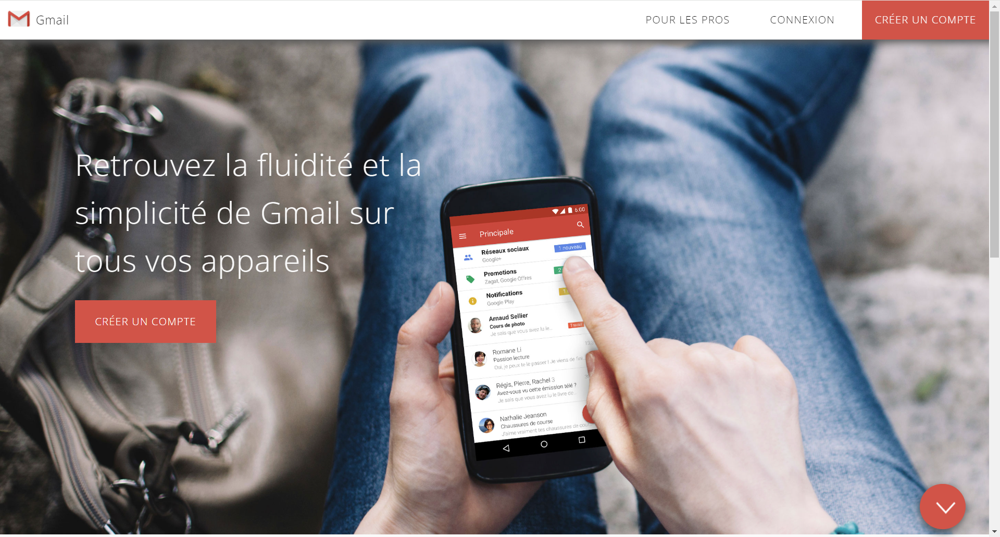
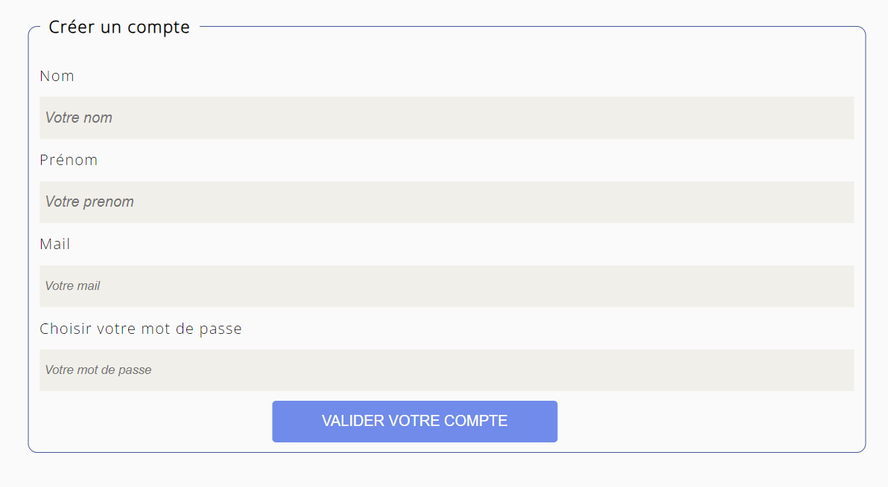

# Partiel Fake Gmail
L'objectif de ce projet est de recréer le site gmail connecté à une base de données. Cela a également permis de mettre 
en application des contrôles de champs, remplir une base de données et en extraire des informations.

Partie statique terminée le 17/01/2024 

Connexion à la base de donnée terminée le 28/02/2024

Ajout des champs du formulaire de création d'un compte à la base de donnée terminé le 28/02/2024

Contrôle si le compte existe pour se connecter sans création d'un nouveau compte terminé le 28/02/2024

## Charte graphique et typographique
Police de caractère : Open-Sans, sans-serif, 1.6rem
Couleur des boutons et items : #dd5347
Couleur de fond : #fafafa
Le bolder : 300 (font-weight)

Lien de déploiement : https://bastienu.github.io/Projet_Gmail/